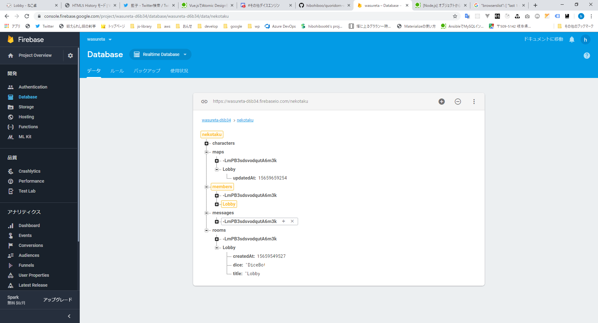
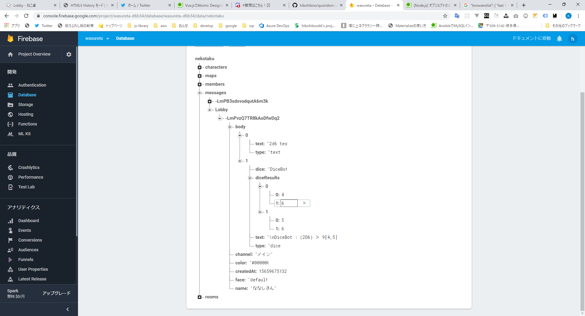

## ロビーで複数のチャットツールをつなぐ

* ルームは固定のLobby
* メッセージの送受信を共有する。

以下のようなフォーマットにしようと思う。
originalは元のチャットメッセージを入れる。

```
{
  chattool: String,
  original: any
  common: {
    name: String,
    text: String,
    createdAt: Number
  },
  createdAt: TimeStamp
}
```

### 確認事項

* 各ツールのルームの保持形式
* 各ツールのチャットメッセージ

#### ねこ卓


* 部屋



```
- maps
  - Lobby
    - updatedAt:String
- rooms
  - Lobby
    - createdAt: ""
    - dice: "DiceBot"
    - title: "ロビー"
```

* メッセージ



```
- messages
  - Lobby
    - メッセージID
      - body
        - 0
          - text "2d6 発言"
          - type "text"
        - 1
          - text: "\nDiceBot : (2D6) ＞ 9 [4,5] ＞ 9"
          - type: "dice"
          - diceResults
            - 0
              - 0:4
              - 1:6
            - 1
              - 0: 5
              - 1: 6
    - face: "default"
    - name: "ななしさん"
    - channel: "メイン"
    - createdAt: ""
    - color: "#000000"
```

#### ココフォリア

* 部屋


```
- ccfolia
  - keys:collection
    - Lobby
      - keys
        - audience:String = "26_pKFAfkU" // 以下3つ、shortId
        - master:String ="S8a4jr28Ew"
        - player: String ="SWcOL_ZkJm"
      - owner: ""
      - updatedAt:number
      - createdAt:number
  - rooms:collection
    - Lobby
      - archived:bool = false // trueで論理削除
      - backgroundUrl:String = ""
      - foregroundUrl:String=""
      - createdAt:number = 1565930300545
      - diceBotName: String
      - diceBotSystem: String
      - fieldHeight: number = 20
      - fieldWidth: number = 30
      - fieldText: String = ""
      - mapType: ""
      - mediaUrl: ""
      - name "Lobby"
      - owner:String =  authId
      - soundName:String = ""
      - soundRepeat: false
      - soundUrl : ""
      - updatedAt:number 
      - members:collection
        - memberId
          - createdAt: number 
          - displayName:String
          - photoUrl: ""
          - updatedAt: number
      - messages:collection
        - messageId
          - name:String = ""
          - text:String = "2d6 test"
          - type:String = "text"
          - createdAt:number
          - updatedAt:number
          - from: String = memberId
          - iconUrl:String = ""
          - to:String = ""
          - extend:Object
            - roll
              - dices
                - 0
                  - faces = 6
                  - value = 1
                - 1
                  - faces  = 6
                  - value = 6
              - result = ": (2D6) ＞ 7[1,6] ＞ 7"
              - secret = false
```

### udonarium
* もともとpeerなのでDBへの接続がない。

## 修正箇所
### nekotaku
* src\browser\backend\FirebaseBackend.ts 

### ccfolia
* src\stores\modules\entities.room.messages.js

### udonarium
* src\app\service\chat-message.service.ts
* src\app\app.component.ts

### quoridorn
* src\store\action_operation.ts
* src\store\action_operation.ts